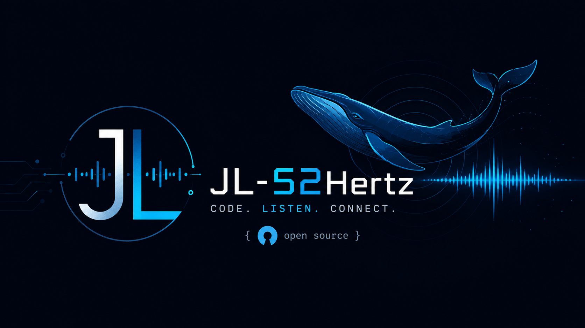

# Daily Paper Digest / 每日论文精选推送

<p align="center">
  
</p>

Languages: [中文说明](#中文说明) | [English Guide](#english-guide)

Author: JL-52Hertz  
Email: 63718897@qq.com

---

## 中文说明

### 1. 这个项目是做什么的？

这是一个自动化论文精选工具。它会在你设置的时间自动搜索指定研究方向的论文，使用 DeepSeek 生成中文结构化总结，然后发送到企业微信群机器人。

默认可以关注 VLM，也可以改成目标检测、高效训练，或者你自己新增的方向。

它会做这些事：

- 从 arXiv、CVF OpenAccess、Semantic Scholar、OpenReview、TPAMI 来源收集论文。
- 用本地 SQLite 建立论文库，默认路径是 `data/papers.db`。
- 自动去重，避免同一篇论文重复发送。
- 每次发送 1 篇论文，发送成功后标记为已发送。
- 支持 Windows、Linux、macOS。
- 支持一天多个发送时间。
- 支持手动导入 PDF 链接或本地 PDF 文件。

发送到微信的内容标题现在是通用的：

```text
每日论文精选
研究方向：Object Detection
```

不会再固定写成“每日 VLM 论文精选”。

### 2. 安装前需要准备什么？

你需要：

- Python 3.11 或更高版本
- uv
- DeepSeek API Key
- 企业微信群机器人 Webhook
- 可选：Semantic Scholar API Key

uv 是一个 Python 项目管理工具，用来安装依赖和运行命令。官方安装教程：

- uv installation: https://docs.astral.sh/uv/getting-started/installation/

最简单的安装方式如下。

Linux/macOS：

```bash
curl -LsSf https://astral.sh/uv/install.sh | sh
```

Windows PowerShell：

```powershell
powershell -ExecutionPolicy ByPass -c "irm https://astral.sh/uv/install.ps1 | iex"
```

安装完成后，重新打开终端，检查是否安装成功：

```bash
uv --version
```

如果你的电脑还没有 Python 3.11，也可以让 uv 帮你安装，并让当前项目固定使用 Python 3.11：

```bash
uv python install 3.11
uv python pin 3.11
uv sync
uv run python --version
```

执行 `uv python pin 3.11` 后，项目目录里会生成 `.python-version` 文件。以后在这个项目里运行 `uv run ...` 时，uv 会优先使用 Python 3.11，不会修改系统自带的 Python。

DeepSeek API 文档：

- https://api-docs.deepseek.com/

企业微信群机器人文档：

- https://developer.work.weixin.qq.com/document/path/91770

### 3. 第一次安装

先把项目下载到本地：

```bash
git clone https://github.com/JL-52Hertz/-Daily-Paper-Digest.git daily-paper-digest
```

进入项目目录：

```bash
cd daily-paper-digest
```

安装依赖：

```bash
uv sync
```

如果你在 Windows PowerShell：

```powershell
Copy-Item .env.example .env
```

如果你在 Linux 或 macOS：

```bash
cp .env.example .env
```

然后编辑 `.env`。

Linux/macOS 可以用：

```bash
nano .env
```

Windows 可以用记事本或 VS Code 打开 `.env`。

### 4. 配置 .env

最小配置如下：

```env
DEEPSEEK_API_KEY=你的_DeepSeek_Key
DEEPSEEK_MODEL=deepseek-v4-pro
WECOM_WEBHOOK_URL=你的_企业微信群机器人_Webhook
WECOM_MESSAGE_TYPE=text
WECOM_TEXT_CHUNK_CHARS=1800
PAPER_DIGEST_TOPICS=vlm
PAPER_DIGEST_SEND_TIMES=08:00
TZ=Asia/Shanghai
```

可选配置：

```env
S2_API_KEY=你的_Semantic_Scholar_Key
PAPER_DIGEST_TOPIC_CONFIG=config/topics.json
PAPER_DIGEST_DB=data/papers.db
PAPER_DIGEST_VENUE_YEARS=2026,2025,2024
PAPER_DIGEST_LOOKBACK_DAYS=3
PAPER_DIGEST_CANDIDATE_LIMIT=50
PAPER_DIGEST_HTTP_TIMEOUT=30
PAPER_DIGEST_MAX_PDF_CHARS=24000
```

配置解释：

| 变量 | 必填 | 作用 |
| --- | --- | --- |
| `DEEPSEEK_API_KEY` | 是 | 调用 DeepSeek 生成论文总结 |
| `DEEPSEEK_MODEL` | 否 | DeepSeek 模型名，默认 `deepseek-v4-pro` |
| `WECOM_WEBHOOK_URL` | 是 | 企业微信群机器人 Webhook |
| `WECOM_MESSAGE_TYPE` | 否 | 推荐 `text`，普通微信也能看；`markdown` 只适合企业微信客户端 |
| `WECOM_TEXT_CHUNK_CHARS` | 否 | text 消息过长时自动拆分，每段最大字符数 |
| `S2_API_KEY` | 否 | Semantic Scholar API Key，不填也能跑，但可能更容易限流 |
| `PAPER_DIGEST_TOPICS` | 否 | 研究方向，多个方向用逗号分隔 |
| `PAPER_DIGEST_SEND_TIMES` | 否 | 每天发送时间，多个时间用逗号分隔 |
| `TZ` | 否 | 时区，建议中国用户使用 `Asia/Shanghai` |
| `PAPER_DIGEST_DB` | 否 | SQLite 论文库路径 |
| `PAPER_DIGEST_VENUE_YEARS` | 否 | 优先回溯哪些年份 |
| `PAPER_DIGEST_LOOKBACK_DAYS` | 否 | arXiv 最近论文回看天数 |
| `PAPER_DIGEST_CANDIDATE_LIMIT` | 否 | 每个来源最多抓多少候选 |
| `PAPER_DIGEST_HTTP_TIMEOUT` | 否 | 网络请求超时时间，单位秒 |
| `PAPER_DIGEST_MAX_PDF_CHARS` | 否 | 送给模型的 PDF 文本最大字符数 |

### 5. 先跑通一次

检查数据库：

```bash
uv run paper-digest db stats
```

第一次可能看到：

```text
total: 0
sent: 0
unsent: 0
target_venue: 0
topic_tagged: 0
```

先预览，不发送微信：

```bash
uv run paper-digest run --dry-run
```

确认内容没问题后正式发送：

```bash
uv run paper-digest run --send
```

如果你想强制重新生成某篇论文的总结：

```bash
uv run paper-digest run --dry-run --refresh-summary
```

### 6. 研究方向怎么改？

查看可用方向：

```bash
uv run paper-digest topics list
```

只看 VLM：

```env
PAPER_DIGEST_TOPICS=vlm
```

只看目标检测：

```env
PAPER_DIGEST_TOPICS=detection
```

同时看多个方向：

```env
PAPER_DIGEST_TOPICS=vlm,detection,efficient_training
```

如果你想添加新方向，比如高效训练：

```bash
uv run paper-digest topics add "Efficient training"
```

只预览，不写入文件：

```bash
uv run paper-digest topics add "Efficient training" --dry-run
```

完全离线生成，不调用 DeepSeek：

```bash
uv run paper-digest topics add "Efficient training" --no-llm
```

覆盖已有方向：

```bash
uv run paper-digest topics add "Efficient training" --force
```

生成后，把 `.env` 改成：

```env
PAPER_DIGEST_TOPICS=efficient_training
```

### 7. 自动论文来源

项目会从这些地方自动找论文：

- arXiv：按 topic 的 `categories` 和 `arxiv_terms` 搜索最近论文。
- CVF OpenAccess：抓 CVPR、ICCV、ECCV 官方 OpenAccess 页面。
- Semantic Scholar：补充 venue/year、作者、摘要、PDF 等元数据。
- OpenReview：抓 ICLR、NeurIPS、ICML、AAAI 等开放评审会议论文。
- IEEE TPAMI：通过 Semantic Scholar 定向检索 TPAMI 论文。

所有论文都会进入同一个 SQLite 论文库，然后统一去重。

### 8. 手动导入论文

如果你有一个 PDF 链接：

```bash
uv run paper-digest import url "https://example.com/paper.pdf" \
  --topic detection \
  --venue CVPR \
  --year 2026
```

如果网络慢，只想先登记，不下载 PDF 正文：

```bash
uv run paper-digest import url "https://example.com/paper.pdf" \
  --topic detection \
  --venue CVPR \
  --year 2026 \
  --no-pdf-text
```

如果你已经下载好了 PDF：

```bash
uv run paper-digest import file /path/to/paper.pdf \
  --topic detection \
  --venue CVPR \
  --year 2026
```

如果自动解析的标题不好，可以手动指定：

```bash
uv run paper-digest import file /path/to/paper.pdf \
  --title "A Sample Paper About Efficient Object Detection" \
  --authors "Alice, Bob" \
  --topic detection \
  --venue CVPR \
  --year 2026
```

导入命令会显示下载和解析进度条。如果不想显示：

```bash
uv run paper-digest import url "https://example.com/paper.pdf" --quiet
```

### 9. 定时发送

设置每天 08:00 发送：

```env
PAPER_DIGEST_SEND_TIMES=08:00
```

一天发送多次：

```env
PAPER_DIGEST_SEND_TIMES=08:00,12:30,20:00
```

查看当前时间配置：

```bash
uv run paper-digest schedule show
```

#### Linux: cron

生成 cron 行：

```bash
uv run paper-digest schedule cron --workdir /path/to/wechat_paper
```

编辑 crontab：

```bash
crontab -e
```

把生成的行粘进去。

查看日志：

```bash
tail -n 100 logs/paper-digest.log
```

#### macOS: launchd

生成 plist：

```bash
uv run paper-digest schedule launchd --workdir /path/to/wechat_paper --uv "$(which uv)" > ~/Library/LaunchAgents/com.paper-digest.daily.plist
```

加载任务：

```bash
launchctl load ~/Library/LaunchAgents/com.paper-digest.daily.plist
```

重新加载：

```bash
launchctl unload ~/Library/LaunchAgents/com.paper-digest.daily.plist
launchctl load ~/Library/LaunchAgents/com.paper-digest.daily.plist
```

#### Windows: Task Scheduler

先找 uv 路径：

```powershell
where.exe uv
```

生成任务计划命令：

```powershell
uv run paper-digest schedule windows --workdir C:\path\to\wechat_paper --uv C:\path\to\uv.exe
```

复制输出的 PowerShell 命令并执行。每个发送时间会生成一个任务。

### 10. 命令和参数总览

全局参数：

| 命令 | 说明 |
| --- | --- |
| `paper-digest --db PATH ...` | 临时指定 SQLite 数据库路径 |

运行：

| 命令 | 说明 |
| --- | --- |
| `paper-digest run --dry-run` | 预览，不发送微信 |
| `paper-digest run --send` | 正式发送到企业微信 |
| `paper-digest run --refresh-summary` | 忽略缓存，重新生成总结 |

数据库：

| 命令 | 说明 |
| --- | --- |
| `paper-digest db init` | 初始化数据库 |
| `paper-digest db stats` | 查看论文库统计 |

研究方向：

| 命令 | 说明 |
| --- | --- |
| `paper-digest topics list` | 查看所有方向 |
| `paper-digest topics add NAME` | 自动生成并添加方向 |
| `--id ID` | 指定方向 ID |
| `--dry-run` | 只预览，不写入 |
| `--force` | 覆盖已有方向 |
| `--no-llm` | 不调用 DeepSeek，用本地规则生成 |

导入论文：

| 参数 | 说明 |
| --- | --- |
| `import url PDF_URL` | 从 PDF 链接导入 |
| `import file PDF_PATH` | 从本地 PDF 导入 |
| `--title` | 手动指定标题 |
| `--authors` | 手动指定作者，逗号分隔 |
| `--venue` | 手动指定 venue，例如 CVPR |
| `--year` | 手动指定年份 |
| `--paper-url` | 手动指定论文主页 |
| `--code-url` | 手动指定代码链接 |
| `--abstract` | 手动指定摘要 |
| `--topic` | 手动指定方向，可重复使用 |
| `--sent` | 导入时标记为已发送 |
| `--no-pdf-text` | 不下载/解析 PDF 正文 |
| `--timeout` | URL 导入的 HTTP 超时时间 |
| `--quiet` | 不显示进度条 |

定时任务：

| 命令 | 说明 |
| --- | --- |
| `schedule show` | 查看发送时间 |
| `schedule cron` | 生成 Linux cron 配置 |
| `schedule launchd` | 生成 macOS launchd plist |
| `schedule windows` | 生成 Windows 任务计划命令 |

### 11. 常见问题

**普通微信看不到 markdown 消息怎么办？**

把 `.env` 设置为：

```env
WECOM_MESSAGE_TYPE=text
```

**下载 PDF 很慢怎么办？**

可以使用代理，但每个人的代理地址和端口不一样。下面命令里的 `http://你的代理地址:端口` 是占位写法，请替换成你自己机器上的代理地址。

```bash
HTTPS_PROXY=http://你的代理地址:端口 uv run paper-digest import url "PDF链接" --topic detection --venue CVPR --year 2026
```

例如有些代理软件可能是 `http://127.0.0.1:7890`，有些可能是 `http://127.0.0.1:1087`，也可能是公司或服务器提供的其他地址。

也可以先登记：

```bash
uv run paper-digest import url "PDF链接" --topic detection --venue CVPR --year 2026 --no-pdf-text
```

**cron 不执行怎么办？**

先用绝对路径生成：

```bash
uv run paper-digest schedule cron --workdir /path/to/wechat_paper --uv /absolute/path/to/uv
```

再检查日志：

```bash
tail -n 100 logs/paper-digest.log
```

**如何确认 API 和企业微信能连通？**

```bash
curl -I https://export.arxiv.org
curl -I https://api.deepseek.com
curl -I https://qyapi.weixin.qq.com
```

企业微信 webhook 可以用一条 text 消息测试。

---

## English Guide

### 1. What is this project?

Daily Paper Digest is a small automation tool for research paper sharing. It searches papers for your configured research topics, asks DeepSeek to write a structured Chinese summary, stores everything in a local SQLite paper library, and sends one selected paper to a WeCom group robot.

It supports:

- Windows, Linux, and macOS.
- Multiple research topics.
- Multiple send times per day.
- Automatic deduplication.
- Manual PDF URL or local PDF import.
- WeCom `text` mode for better compatibility with regular WeChat clients.

The WeCom message starts with a generic heading:

```text
每日论文精选
研究方向：Object Detection
```

It no longer hardcodes “Daily VLM Paper”.

### 2. Requirements

You need:

- Python 3.11+
- uv
- DeepSeek API key
- WeCom group robot webhook
- Optional: Semantic Scholar API key

Install uv from the official guide:

- https://docs.astral.sh/uv/getting-started/installation/

The simplest install commands are:

Linux/macOS:

```bash
curl -LsSf https://astral.sh/uv/install.sh | sh
```

Windows PowerShell:

```powershell
powershell -ExecutionPolicy ByPass -c "irm https://astral.sh/uv/install.ps1 | iex"
```

After installation, reopen your terminal and verify uv:

```bash
uv --version
```

If your machine does not have Python 3.11 yet, uv can install it and pin this project to Python 3.11:

```bash
uv python install 3.11
uv python pin 3.11
uv sync
uv run python --version
```

After `uv python pin 3.11`, uv creates a `.python-version` file in the project directory. Future `uv run ...` commands in this project will prefer Python 3.11 without changing your system Python.

DeepSeek API docs:

- https://api-docs.deepseek.com/

WeCom group robot docs:

- https://developer.work.weixin.qq.com/document/path/91770

### 3. Install

Clone the project first:

```bash
git clone https://github.com/JL-52Hertz/-Daily-Paper-Digest.git daily-paper-digest
cd daily-paper-digest
uv sync
```

Create your local `.env` file.

Windows PowerShell:

```powershell
Copy-Item .env.example .env
```

Linux/macOS:

```bash
cp .env.example .env
```

Edit `.env` with your keys.

### 4. Configure `.env`

Minimal configuration:

```env
DEEPSEEK_API_KEY=your_deepseek_api_key
DEEPSEEK_MODEL=deepseek-v4-pro
WECOM_WEBHOOK_URL=your_wecom_webhook_url
WECOM_MESSAGE_TYPE=text
WECOM_TEXT_CHUNK_CHARS=1800
PAPER_DIGEST_TOPICS=vlm
PAPER_DIGEST_SEND_TIMES=08:00
TZ=Asia/Shanghai
```

Optional configuration:

```env
S2_API_KEY=your_semantic_scholar_api_key
PAPER_DIGEST_TOPIC_CONFIG=config/topics.json
PAPER_DIGEST_DB=data/papers.db
PAPER_DIGEST_VENUE_YEARS=2026,2025,2024
PAPER_DIGEST_LOOKBACK_DAYS=3
PAPER_DIGEST_CANDIDATE_LIMIT=50
PAPER_DIGEST_HTTP_TIMEOUT=30
PAPER_DIGEST_MAX_PDF_CHARS=24000
```

### 5. First run

Check the paper database:

```bash
uv run paper-digest db stats
```

Preview without sending:

```bash
uv run paper-digest run --dry-run
```

Send to WeCom:

```bash
uv run paper-digest run --send
```

Regenerate a cached summary:

```bash
uv run paper-digest run --dry-run --refresh-summary
```

### 6. Research topics

List topics:

```bash
uv run paper-digest topics list
```

Use one topic:

```env
PAPER_DIGEST_TOPICS=detection
```

Use multiple topics:

```env
PAPER_DIGEST_TOPICS=vlm,detection,efficient_training
```

Generate a new topic from a short name:

```bash
uv run paper-digest topics add "Efficient training"
```

Preview generated JSON only:

```bash
uv run paper-digest topics add "Efficient training" --dry-run
```

Generate without DeepSeek:

```bash
uv run paper-digest topics add "Efficient training" --no-llm
```

Enable the new topic in `.env`:

```env
PAPER_DIGEST_TOPICS=efficient_training
```

### 7. Paper sources

Automatic discovery currently uses:

- arXiv
- CVF OpenAccess for CVPR, ICCV, ECCV
- Semantic Scholar
- OpenReview for ICLR, NeurIPS, ICML, AAAI
- IEEE TPAMI through Semantic Scholar

All discovered papers are stored in `data/papers.db` and deduplicated.

### 8. Manual import

Import from a PDF URL:

```bash
uv run paper-digest import url "https://example.com/paper.pdf" \
  --topic detection \
  --venue CVPR \
  --year 2026
```

Skip PDF text extraction:

```bash
uv run paper-digest import url "https://example.com/paper.pdf" \
  --topic detection \
  --venue CVPR \
  --year 2026 \
  --no-pdf-text
```

Import from a local PDF:

```bash
uv run paper-digest import file /path/to/paper.pdf \
  --topic detection \
  --venue CVPR \
  --year 2026
```

Override metadata:

```bash
uv run paper-digest import file /path/to/paper.pdf \
  --title "A Sample Paper About Efficient Object Detection" \
  --authors "Alice, Bob" \
  --topic detection \
  --venue CVPR \
  --year 2026
```

### 9. Scheduling

One send time:

```env
PAPER_DIGEST_SEND_TIMES=08:00
```

Multiple send times:

```env
PAPER_DIGEST_SEND_TIMES=08:00,12:30,20:00
```

Show schedule:

```bash
uv run paper-digest schedule show
```

Linux cron:

```bash
uv run paper-digest schedule cron --workdir /path/to/wechat_paper
```

macOS launchd:

```bash
uv run paper-digest schedule launchd --workdir /path/to/wechat_paper --uv "$(which uv)" > ~/Library/LaunchAgents/com.paper-digest.daily.plist
launchctl load ~/Library/LaunchAgents/com.paper-digest.daily.plist
```

Windows Task Scheduler:

```powershell
where.exe uv
uv run paper-digest schedule windows --workdir C:\path\to\wechat_paper --uv C:\path\to\uv.exe
```

Copy and run the generated PowerShell commands.

### 10. Command reference

Global:

| Command | Description |
| --- | --- |
| `paper-digest --db PATH ...` | Use a custom SQLite database |

Run:

| Command | Description |
| --- | --- |
| `paper-digest run --dry-run` | Preview only |
| `paper-digest run --send` | Send to WeCom |
| `paper-digest run --refresh-summary` | Regenerate cached summary |

Database:

| Command | Description |
| --- | --- |
| `paper-digest db init` | Initialize database |
| `paper-digest db stats` | Show database stats |

Topics:

| Command / Option | Description |
| --- | --- |
| `paper-digest topics list` | List topics |
| `paper-digest topics add NAME` | Generate and add a topic |
| `--id ID` | Override generated topic id |
| `--dry-run` | Preview only |
| `--force` | Overwrite existing topic |
| `--no-llm` | Use local heuristic generation |

Import:

| Option | Description |
| --- | --- |
| `import url PDF_URL` | Import from PDF URL |
| `import file PDF_PATH` | Import from local PDF |
| `--title` | Override title |
| `--authors` | Comma-separated authors |
| `--venue` | Venue, for example CVPR |
| `--year` | Publication year |
| `--paper-url` | Canonical paper page |
| `--code-url` | Code/project URL |
| `--abstract` | Override abstract |
| `--topic` | Topic id, repeatable |
| `--sent` | Mark as already sent |
| `--no-pdf-text` | Skip PDF text extraction |
| `--timeout` | HTTP timeout in seconds |
| `--quiet` | Hide progress output |

Schedule:

| Command | Description |
| --- | --- |
| `schedule show` | Show configured send times |
| `schedule cron` | Generate Linux cron lines |
| `schedule launchd` | Generate macOS launchd plist |
| `schedule windows` | Generate Windows Task Scheduler commands |

### 11. Troubleshooting

If regular WeChat cannot read the robot message, use:

```env
WECOM_MESSAGE_TYPE=text
```

If PDF download is slow, use a proxy. The `http://your-proxy-host:port` value below is a placeholder. Replace it with your own proxy address and port.

```bash
HTTPS_PROXY=http://your-proxy-host:port uv run paper-digest import url "PDF_URL" --topic detection --venue CVPR --year 2026
```

For example, some proxy tools use `http://127.0.0.1:7890`, some use `http://127.0.0.1:1087`, and some networks provide a different proxy address.

If you only want to register a paper first:

```bash
uv run paper-digest import url "PDF_URL" --topic detection --venue CVPR --year 2026 --no-pdf-text
```

If scheduled jobs fail, generate scheduler config with an absolute uv path and check logs.
